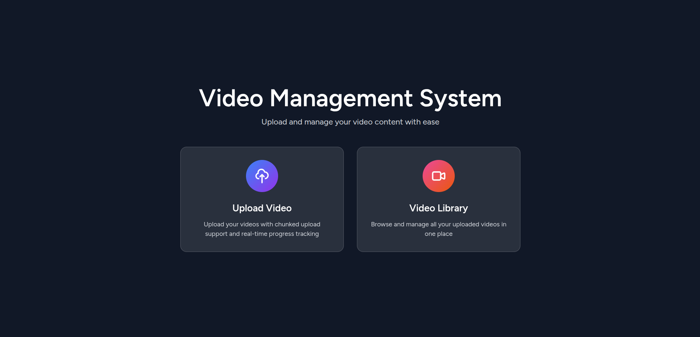
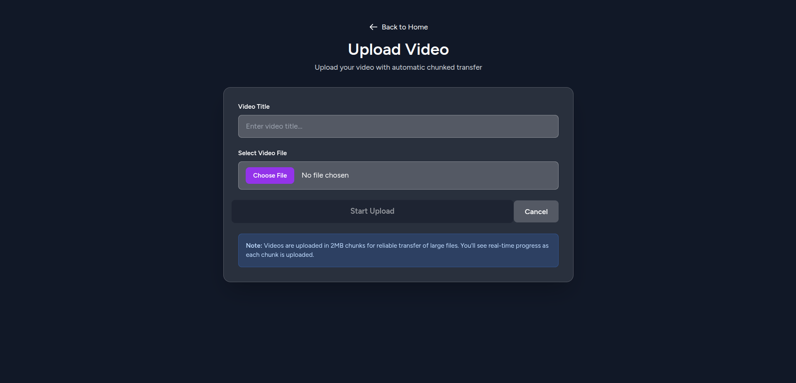
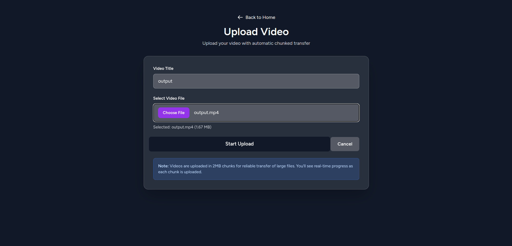
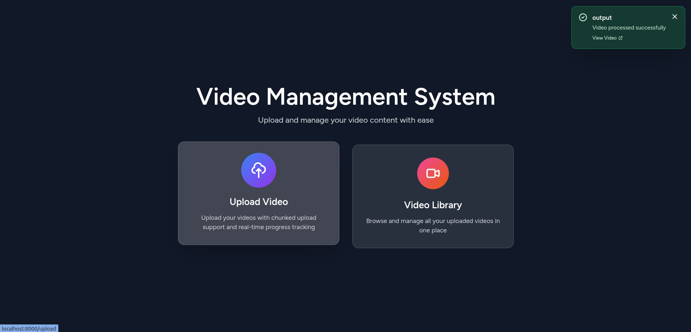

# 📹 Video Management System with Chunked Upload & Real-Time MQTT Notifications

A modern web application built with Laravel 11 and Vue 3 that enables seamless video file uploads with chunked transfer, real-time progress tracking, and MQTT-based notifications for video processing updates.

---

## 📋 Table of Contents

- [Features](#features)
- [Screenshots](#screenshots)
- [Tech Stack](#tech-stack)

---

## ✨ Features

### 🎯 Core Features
- **Chunked File Upload**: Upload large video files in 2MB chunks for reliable transfer
- **Real-Time Progress Tracking**: Visual progress bar showing upload percentage and chunk count
- **Multiple File Type Support**: Videos, images, audio (MP3), and ZIP files
- **Video Library**: Beautiful grid-based video gallery with preview and playback
- **MQTT Notifications**: Real-time toast notifications for video processing updates
- **Delete Functionality**: Remove uploaded videos with confirmation modal
- **Responsive Design**: Works seamlessly on desktop, tablet, and mobile devices

### 🎨 UI/UX Features
- Modern gradient-based dark theme
- Glass morphism effects (frosted glass look)
- Smooth animations and transitions
- Toast notifications with auto-dismiss
- Modal-based video player
- Hover effects and interactive elements

### 🔧 Technical Features
- **Secure File Storage**: Server-side file management with organized storage
- **Database Integration**: MySQL database for video metadata
- **Auto-Reconnection**: MQTT client automatically reconnects on connection loss
- **Error Handling**: Comprehensive error handling with user-friendly messages
- **Clean Architecture**: Separation of concerns with services and components

---

## 📸 Screenshots

### Landing Page
<!-- Add screenshot: screenshots/landing-page.png -->

*Beautiful landing page with navigation to upload and video library*

### Video Upload Page
<!-- Add screenshot: screenshots/upload-page.png -->

*Upload interface with file selection and title input*

### Video Library
<!-- Add screenshot: screenshots/video-library.png -->

*Grid-based video library with thumbnails and metadata*

### Landing Page After Upload
<!-- Add screenshot: screenshots/video-player.png -->

*Notification after Upload video on Cloud*

---

## 🛠️ Tech Stack

### Backend
- **Framework**: Laravel 11.x
- **Language**: PHP 8.2+
- **Database**: MySQL 8.0+
- **Queue System**: Database-based queue

### Frontend
- **Framework**: Vue 3 (Composition API)
- **Routing**: Inertia.js
- **Build Tool**: Vite 6.x
- **Styling**: Tailwind CSS 3.x
- **HTTP Client**: Axios
- **MQTT Client**: Paho MQTT

### Real-Time Communication
- **Protocol**: MQTT over WebSocket with TLS
- **Broker**: Custom MQTT broker
- **Topics**: `video/processed`
- **QoS**: 0

---

**Made with ❤️ using Laravel and Vue.js**
